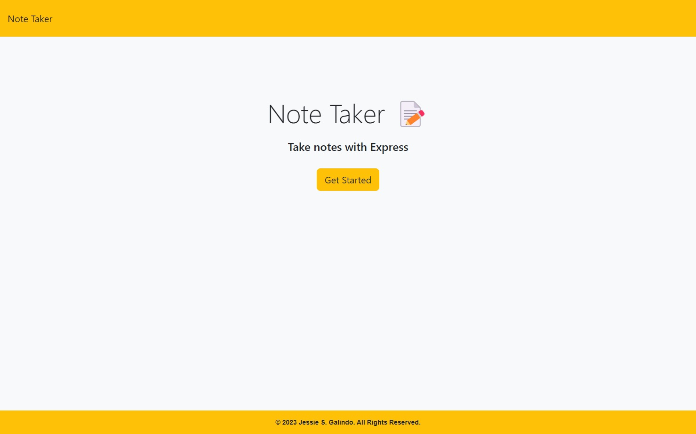
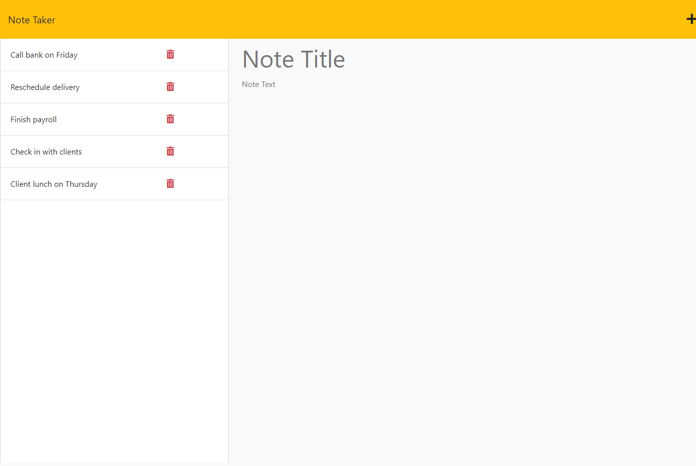

# Note Taker

## Description

I was tasked with creating a working note taking app that saves each note separately in a tab that you can select at a later time and continue to edit it as well as add new notes. I used Node.js, Express, and UUID.

## Installation

No installation necessary but you can clone the [repository](https://github.com/MrMessyFace/note-taker) from GitHub to edit it and make your own version. After you have cloned the repository, you would type "npm i" into the terminal to install the NPM packages. After the packages are installed, you would type "node server.js" into the terminal to start the server. You would then type "http://localhost:3001/" into your browser to view the app as you edit it.

## Usage

When a user opens the webpage, they can click the "Get Started" button to open the notes section. They can then start adding notes to the site and can delete any notes at any time.

## Credits

The starter code was provided by the Northwestern University Full Stack Coding Bootcamp and was modified to allow for writing and saving notes.

## License

## Helpful Links

- [Repository](https://github.com/MrMessyFace/note-taker)
- [Live App](https://notes-app-jg2023.herokuapp.com/)

&copy; 2023 Jessie S. Galindo. All Rights Reserved.
